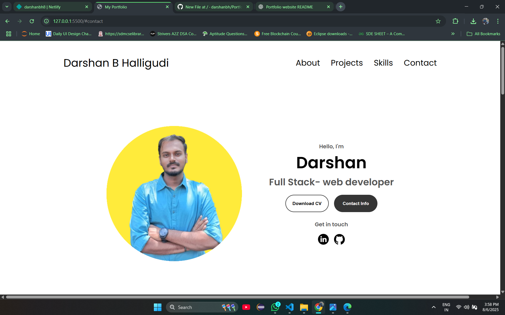
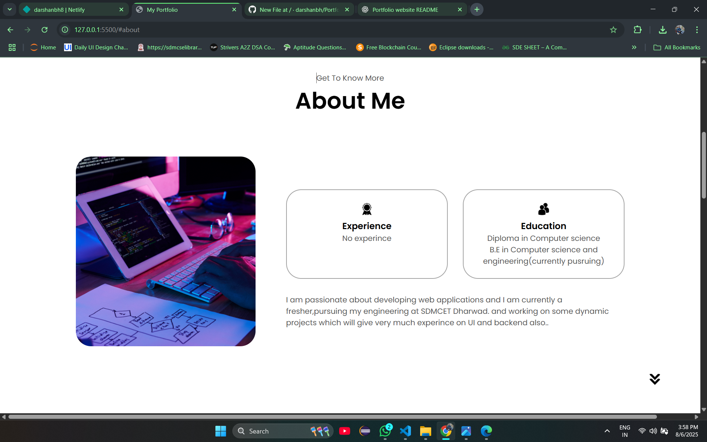
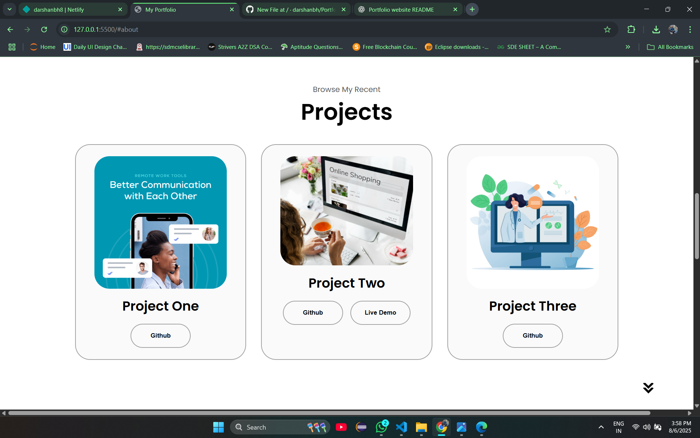

# 🌐 Personal Portfolio Website

This is a clean and responsive **Portfolio Website** built using **HTML, CSS, and JavaScript**. It showcases my skills, projects, education, and contact information in a professional layout.  

> ✅ Live Demo: [Your Portfolio](https://yourusername.github.io/your-repo-name/)

---


---

## 🚀 Features

- ✅ Responsive Design (Mobile + Desktop)
- ✅ Smooth Scroll Navigation
- ✅ Skills Section
- ✅ Projects Gallery with links
- ✅ Contact Form / Info
- ✅ Dark & Light mode (optional)

---

## 📷 Screenshots

| Homepage | Projects Section |
|---------|------------------|
## 📷 Screenshots

| Homepage | Projects Section |
|----------|------------------|
|  |  |  

---

## 🛠️ Built With

- HTML5
- CSS3 (Flexbox, Grid)
- JavaScript (Vanilla)

---

## 📦 How to Use / Run Locally

```bash
# 1. Clone the repo
git clone https://github.com/yourusername/your-repo-name.git

# 2. Open the folder
cd your-repo-name

# 3. Open index.html in your browser


